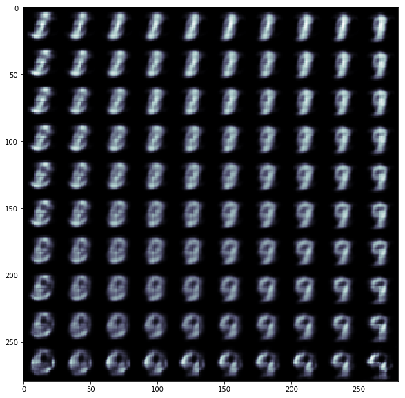
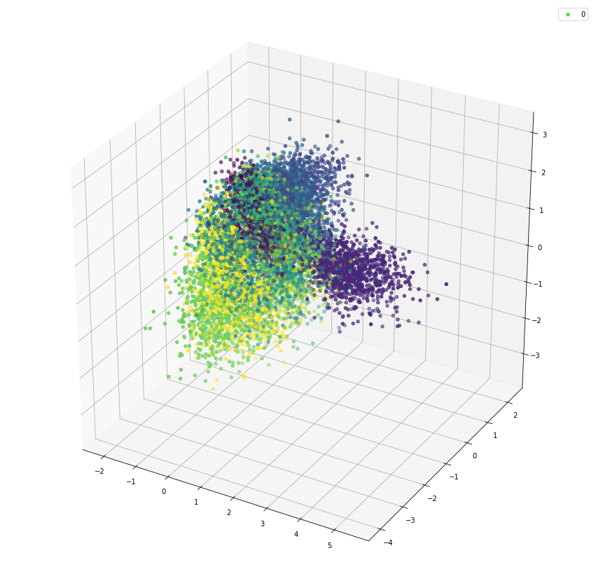
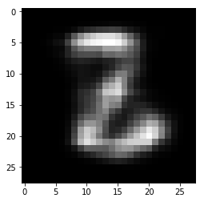
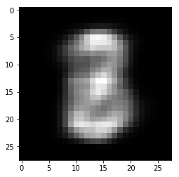
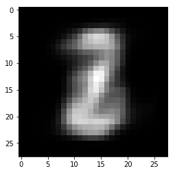

# varitional-auto-encoder

## Variational auto-encoder in MNIST images

- Using KL divergence in auto encoder to make it generative
- Estimating distributions of the latent variable for a image rather then solid points
- Thus the network not only memorizes the latent variable of a image to decode but rather learns the features of the images
- First step in learning geanrative networks

# Some images generated by the VAE which had 2 latent dimension

# 3-D representation of the latent variable according to the digit it represents in vae with 3 latent spaces

# Playing around with latent variables to construct new digits

- Here we can see that new generated images carry some property of digits

